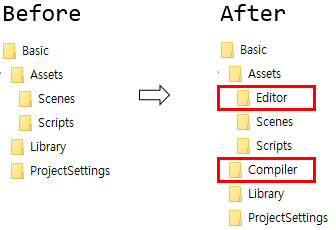
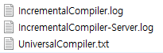

# Unity3D.IncrementalCompiler

Unity3D Incremental C# Compiler using [Roslyn](https://github.com/dotnet/roslyn).
- You can get faster compilation speed. Because it works as an
  [incremental compiler](https://en.wikipedia.org/wiki/Incremental_compiler)
- You can use C# 5 and 6 features.

This project is at an early development stage.
And still now it can support only windows platform.

### Setup

Unzip [a release zip file](https://github.com/SaladbowlCreative/Unity3D.IncrementalCompiler/releases)
to your unity project top-most directory.

- When Unity 4.x, use IncrementalCompiler.Unity4.zip
- When Unity 5.x, use IncrementalCompiler.Unity5.zip

A release zip has a plugin dll which should be put at Editor folder and
a few compiler related files which should be put at Compiler folder.
Following before and after screenshot will helps for understanding install location.

While an incremental compiler build your scripts, it saves log files to project/Temp
directory. With these log files, you can see how it works.

### Configuration

Basically this compiler works transparently but you can configure subtle details.
Check a configure file which is located at project/Compiler/[IncrementalCompiler.xml](https://github.com/SaladbowlCreative/Unity3D.IncrementalCompiler/blob/master/core/IncrementalCompiler/IncrementalCompiler.xml)

### More information

- [Benchmark](./docs/Benchmark.md)
- [Under the hood](./docs/UnderTheHood.md)

### Related works

- An integration part between unity3d and incremental compiler is based on
  [alexzzzz](https://bitbucket.org/alexzzzz/unity-c-5.0-and-6.0-integration/src)'s works.
- Mono MDB writer for roslyn is based on
  [marek-safar](https://github.com/marek-safar)'s
  [work](https://github.com/mono/roslyn/pull/4).
